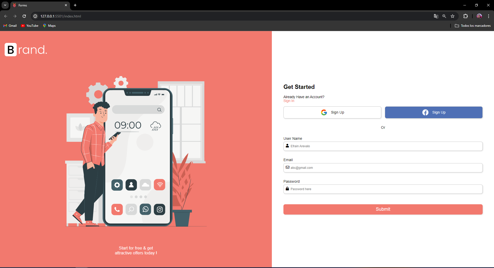

# Formulario de Registro - Proyecto HTML/CSS/JS

Este es un proyecto de formulario de registro simple desarrollado utilizando HTML, CSS y JavaScript. El formulario incluye validación en tiempo real para los campos de usuario, correo electrónico y contraseña.

## Funcionalidades

- Validación en tiempo real de los campos del formulario:
  - El campo de usuario no puede estar vacío.
  - El campo de correo electrónico debe ser un formato válido.
  - El campo de contraseña no puede estar vacío.

- Integración con servicios de inicio de sesión:
  - Se proporcionan opciones para registrarse utilizando Google o Facebook.

## Capturas de Pantalla

## Tecnologías Utilizadas

- HTML
- CSS
- JavaScript

## Uso

1. Clona este repositorio en tu máquina local.
2. Abre el archivo `index.html` en tu navegador web.
3. Completa el formulario y observa la validación en tiempo real.

## Contribución

¡Las contribuciones son bienvenidas! Si tienes sugerencias para mejoras o nuevas funcionalidades, siéntete libre de abrir un issue o enviar un pull request.

## Autor

- Nombre: [EFrain Arévalo]
- GitHub: [Efraska](https://github.com/Efraska/efrasss)

## Licencia

Este proyecto está bajo la Licencia [MIT](https://opensource.org/licenses/MIT).
